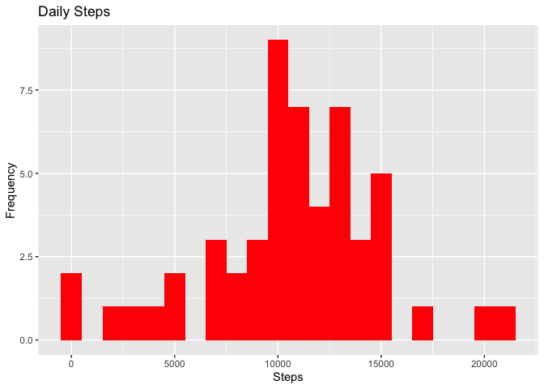
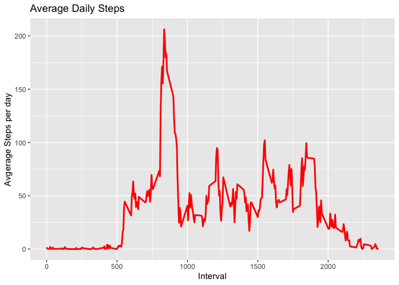
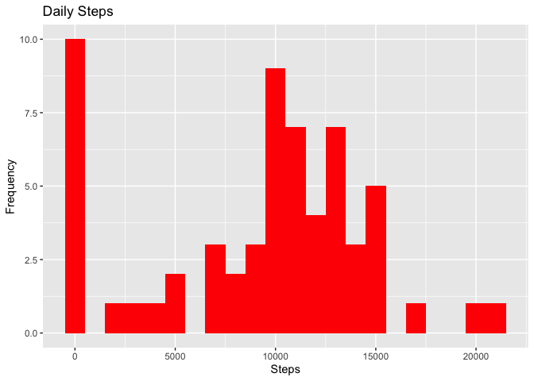
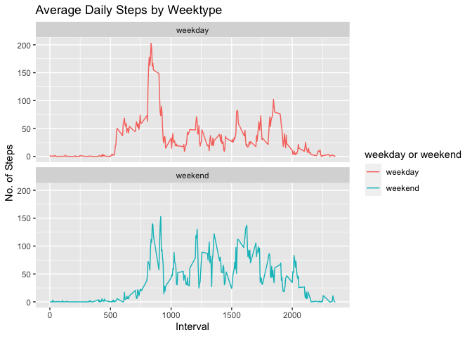

## Loading and preprocessing the data

Downloading the zipped file and then unzipping the data to obtain a csv file.


```r
library("data.table")
library(ggplot2)
fileUrl <- "https://d396qusza40orc.cloudfront.net/repdata%2Fdata%2Factivity.zip"
download.file(fileUrl, destfile = paste0(getwd(), '/repdata%2Fdata%2Factivity.zip'), method = "curl")
unzip("repdata%2Fdata%2Factivity.zip",exdir = "data")
```

Reading the csv data into a data table 


```r
activity_DT <- data.table::fread(input = "data/activity.csv")
```

## What is mean total number of steps taken per day?

Calculating the total number of steps taken per day.


```r
Steps_tot <- activity_DT[, c(lapply(.SD, sum, na.rm = FALSE)), .SDcols = c("steps"), by = .(date)] 
head(Steps_tot, 10)
```

```
##           date steps
##  1: 2012-10-01    NA
##  2: 2012-10-02   126
##  3: 2012-10-03 11352
##  4: 2012-10-04 12116
##  5: 2012-10-05 13294
##  6: 2012-10-06 15420
##  7: 2012-10-07 11015
##  8: 2012-10-08    NA
##  9: 2012-10-09 12811
## 10: 2012-10-10  9900
```

Histogram of total number of steps taken each day

```r
ggplot(Steps_tot, aes(x = steps)) +
    geom_histogram(fill = "red", binwidth = 1000) +
    labs(title = "Daily Steps", x = "Steps", y = "Frequency")
```

```
## Warning: Removed 8 rows containing non-finite values (stat_bin).
```

<!-- -->

Calculate the mean and median of the total number of steps taken per day.


```r
Steps_tot[, .(Mean_Steps = mean(steps, na.rm = TRUE), Median_Steps = median(steps, na.rm = TRUE))]
```

```
##    Mean_Steps Median_Steps
## 1:   10766.19        10765
```


## What is the average daily activity pattern?

Plotting a time series plot (i.e. 𝚝𝚢𝚙𝚎 = "𝚕") of the 5-minute interval (x-axis) and the average number of steps taken, averaged across all days (y-axis)


```r
Interval_DT <- activity_DT[, c(lapply(.SD, mean, na.rm = TRUE)), .SDcols = c("steps"), by = .(interval)] 
ggplot(Interval_DT, aes(x = interval, y = steps)) + geom_line(color = "red", size = 1) + labs(title = "Average Daily Steps", x = "Interval", y = "Avgerage Steps per day")
```

<!-- -->

We will now calculate the 5-minute interval that contains the maximum number of steps on average across all the days in the dataset:


```r
Interval_DT[steps == max(steps), .(max_interval = interval)]
```

```
##    max_interval
## 1:          835
```


## Imputing missing values

We will calculate the total number of missing values in the dataset (i.e. the total number of rows with 𝙽𝙰s)


```r
activity_DT[is.na(steps), .N ]
```

```
## [1] 2304
```
Let's fill in all of the missing values using the median for that day in the dataset.


```r
# Filling in missing values with median of dataset. 
activity_DT[is.na(steps), "steps"] <- activity_DT[, c(lapply(.SD, median, na.rm = TRUE)), .SDcols = c("steps")]
```

We will now create a new dataset equal to the original dataset but with the missing data filled in.


```r
data.table::fwrite(x = activity_DT, file = "data/tidyData.csv", quote = FALSE)
```

Calculate the mean and the median of total number of steps taken per day with imputed 𝙽𝙰 values.


```r
# total number of steps taken per day
## Are there differences in activity patterns between weekdays and weekends?
Steps_tot <- activity_DT[, c(lapply(.SD, sum)), .SDcols = c("steps"), by = .(date)] 
# mean and median total number of steps taken per day
Steps_tot[, .(Mean_Steps = mean(steps), Median_Steps = median(steps))]
```

```
##    Mean_Steps Median_Steps
## 1:    9354.23        10395
```

```r
ggplot(Steps_tot, aes(x = steps)) + geom_histogram(fill = "red", binwidth = 1000) + labs(title = "Daily Steps", x = "Steps", y = "Frequency")
```

<!-- -->

Above we have plotted a histogram of the total number of steps taken each day with imputed 𝙽𝙰 values.


Type of Estimate | Mean_Steps | Median_Steps
--- | --- | ---
First Part (with 𝙽𝙰 values) | 10766.19 | 10765
Second Part (filling 𝙽𝙰 values with median) | 9354.23 | 10395

## Comparing the activity patterns between weekdays and weekends

Creating a new factor variable in the dataset with two levels – “weekday” and “weekend”, indicating whether a given date is a weekday or a weekend.


```r
activity_DT <- data.table::fread(input = "data/activity.csv")
activity_DT[, date := as.POSIXct(date, format = "%Y-%m-%d")]
activity_DT[, `Day of Week`:= weekdays(x = date)]
activity_DT[grepl(pattern = "Monday|Tuesday|Wednesday|Thursday|Friday", x = `Day of Week`), "weekday or weekend"] <- "weekday"
activity_DT[grepl(pattern = "Saturday|Sunday", x = `Day of Week`), "weekday or weekend"] <- "weekend"
activity_DT[, `weekday or weekend` := as.factor(`weekday or weekend`)]
head(activity_DT, 10)
```

```
##     steps       date interval Day of Week weekday or weekend
##  1:    NA 2012-10-01        0      Monday            weekday
##  2:    NA 2012-10-01        5      Monday            weekday
##  3:    NA 2012-10-01       10      Monday            weekday
##  4:    NA 2012-10-01       15      Monday            weekday
##  5:    NA 2012-10-01       20      Monday            weekday
##  6:    NA 2012-10-01       25      Monday            weekday
##  7:    NA 2012-10-01       30      Monday            weekday
##  8:    NA 2012-10-01       35      Monday            weekday
##  9:    NA 2012-10-01       40      Monday            weekday
## 10:    NA 2012-10-01       45      Monday            weekday
```

Plotting panel plot containing two time series plot (i.e. 𝚝𝚢𝚙𝚎 = "𝚕") of the 5-minute interval (x-axis) and the average number of steps taken (y-axis), one averaged across all weekday days and the other averaged across all weekends.


```r
activity_DT[is.na(steps), "steps"] <- activity_DT[, c(lapply(.SD, median, na.rm = TRUE)), .SDcols = c("steps")]
IntervalDT <- activity_DT[, c(lapply(.SD, mean, na.rm = TRUE)), .SDcols = c("steps"), by = .(interval, `weekday or weekend`)] 
ggplot(IntervalDT , aes(x = interval , y = steps, color=`weekday or weekend`)) + geom_line() + labs(title = "Average Daily Steps by Weektype", x = "Interval", y = "No. of Steps") + facet_wrap(~`weekday or weekend` , ncol = 1, nrow=2)
```

<!-- -->
